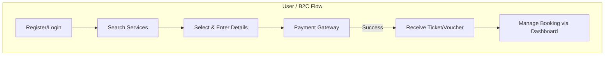
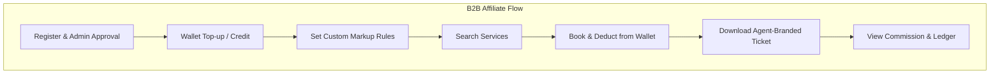
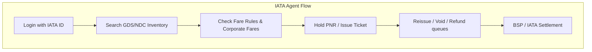
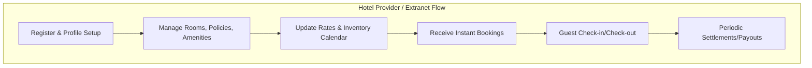
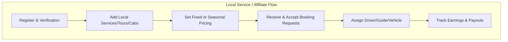
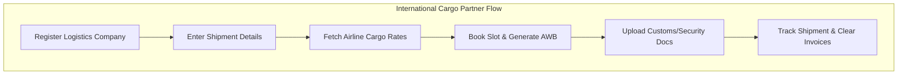
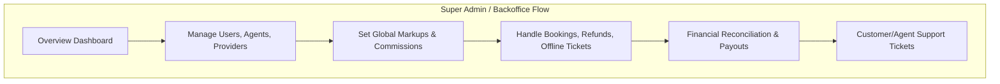

# TripZant System Panels - Flow Documentation

This document outlines the step-by-step user, system, and operational flows for all the major panels/actors within the TripZant ecosystem.

---

## 1. User (B2C) Panel Flow
**Target Audience**: Direct retail customers.

**Step-by-step Flow:**
1. **Onboarding:** User registers or logs in via Email, Phone (OTP), or Social Login.
2. **Search:** Enters search criteria (Flights, Hotels, Packages, Cabs).
3. **Select:** Filters, compares, and selects the desired service.
4. **Guest Details:** Enters passenger/guest information.
5. **Payment:** Proceeds to checkout via standard Payment Gateways (Credit Card, UPI, Wallets).
6. **Confirmation:** System books the service, generates PNR/Booking ID, and sends Email/SMS.
7. **Post-Booking Dashboard:** User can view, modify, download tickets, or cancel bookings.

---

## 2. B2B Affiliate (Travel Agent) Panel Flow
**Target Audience**: Non-IATA Travel Agencies, Freelance Agents, and Sub-agents.

**Step-by-step Flow:**
1. **Onboarding:** Agent registers and submits KYC/business documents. Admin reviews and approves the account.
2. **Wallet/Credit:** Agent tops up their B2B Wallet or uses an assigned Credit Limit.
3. **Markup Configuration:** Agent sets their own custom markup or commission rules to be added to net prices.
4. **Search & Book:** Searches for services. The system shows net prices or marked-up prices.
5. **Checkout:** Deducts the total amount directly from the Agent Wallet. No external payment gateway needed per booking.
6. **Ticketing:** Issues tickets instantly with the Agent's own branding/logo (White-labeling).
7. **Reporting:** Agent views ledgers, commission reports, and sales history.

---

## 3. IATA (Corporate/GDS Agent) Panel Flow
**Target Audience**: IATA-certified agencies with direct GDS access capabilities.

**Step-by-step Flow:**
1. **Onboarding:** Logs in with certified IATA credentials/Office ID.
2. **Search:** Searches core GDS (Amadeus, Sabre) and NDC inventories directly through the portal's integrated engine.
3. **Fare Rules:** Views detailed fare bases, baggage rules, and corporate/negotiated fares.
4. **Ticketing & PNR:** Holds PNR, issues tickets against their own BSP (Billing and Settlement Plan) or platform's capping limit.
5. **Post-Ticketing:** Reissue, void, or refund tickets via automated queues directly linked to GDS.
6. **Settlement:** Handles automated IATA reporting and backend reconciliation.

---

## 4. Hotel Provider (Extranet) Panel Flow
**Target Audience**: Direct Hoteliers, Bedbanks, or Property Managers.

**Step-by-step Flow:**
1. **Registration:** Property signs up and provides necessary licensing/bank details.
2. **Property Setup:** Creates property profile, adds room types, amenities, policies, and photos.
3. **Inventory Management:** Updates daily pricing, availability calendar, and blackout dates.
4. **Booking Management:** Receives instant booking notifications from B2B and B2C channels. Can view guest details and special requests.
5. **Check-in/Check-out:** Manages the active guest roster at the front desk.
6. **Payouts/Settlement:** Invoices the platform and receives periodic payouts for completed stays based on contracted commission models.

---

## 5. Local Service Provider / Affiliate Panel Flow
**Target Audience**: Local Cab operators, Tour guides, Bus operators, and Homestays.

**Step-by-step Flow:**
1. **Onboarding:** Local provider registers and is verified by the platform admin.
2. **Catalog Creation:** Adds specific local services (e.g., Airport Transfer, Half-day City Tour).
3. **Pricing:** Sets fixed prices or dynamic rates based on seasonality/demand.
4. **Booking Fulfilment:** Receives booking requests. System auto-confirms or provider accepts/rejects manually depending on setup.
5. **Operations:** Assigns specific drivers/guides/vehicles and updates status (En-route, Completed).
6. **Financials:** Tracks earnings and withdraws funds periodically.

---

## 6. International Cargo Partner Panel Flow
**Target Audience**: Freight forwarders, Logistics companies, and Shippers.

**Step-by-step Flow:**
1. **Onboarding:** Registers with commercial logistics credentials and corporate details.
2. **Quote Generation:** Enters shipment details (Origin, Destination, Weight, Dimensions, Type of Goods/Hazmat status).
3. **Search:** System fetches cargo capacity and rates from partner airlines.
4. **Booking & AWB:** Books the cargo slot and generates the Air Waybill (AWB).
5. **Documentation:** Uploads customs, security, and manifest documents digitally.
6. **Tracking & Payment:** Settles payment via corporate account/wallet. Tracks shipment status from origin to destination.

---

## 7. Super Admin (Backoffice) Panel Flow
**Target Audience**: Platform owners, Finance teams, and internal operations.

**Step-by-step Flow:**
1. **Dashboard:** High-level overview of sales, active bookings, top agents, and system health.
2. **User/Partner Management:** Approves B2B agents, Providers, handles KYC, and manages platform access levels.
3. **Markup & Financials:** Sets global platform markups, manages payment gateways, reconciles BSP, and handles supplier payouts.
4. **Booking Management:** Manual intervention for failed bookings, processes refunds, issues offline tickets, handles disputes.
5. **Support:** Ticketing system to handle queries from all other panels (B2B, B2C, Providers).

