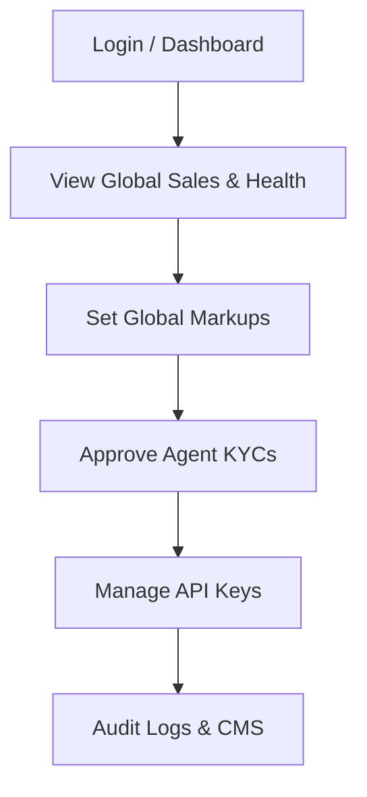
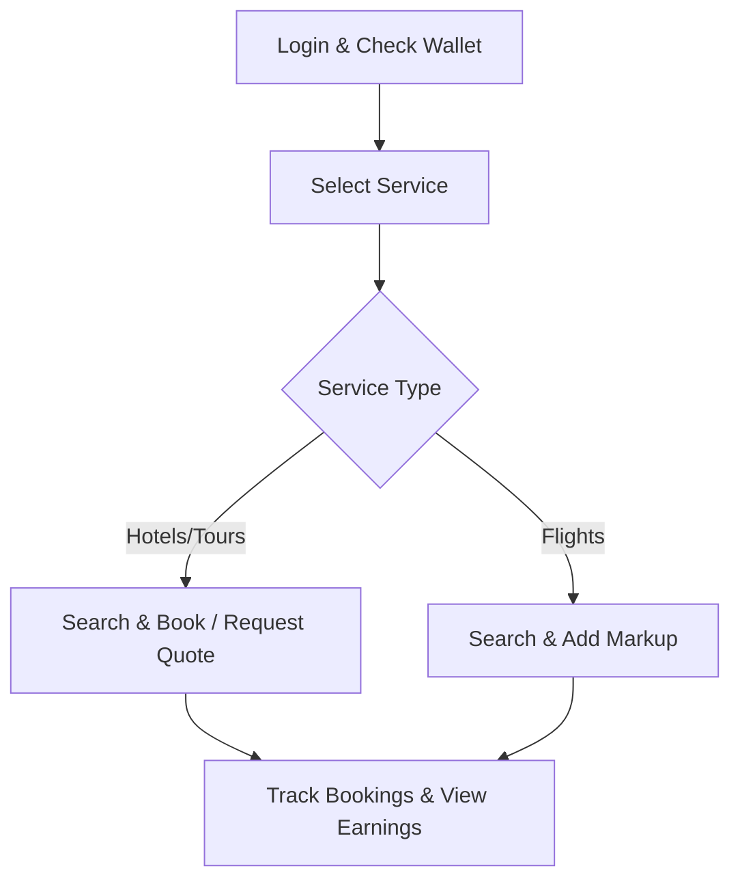
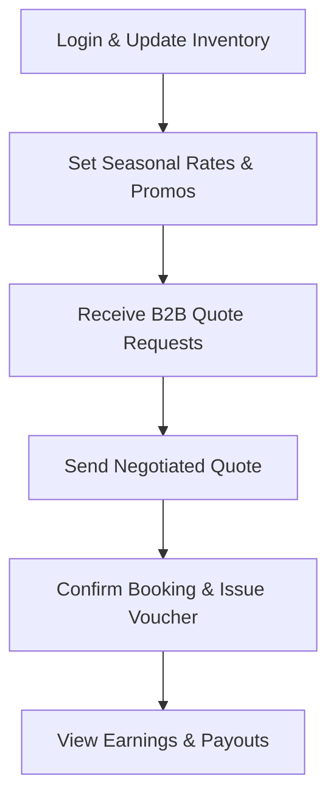
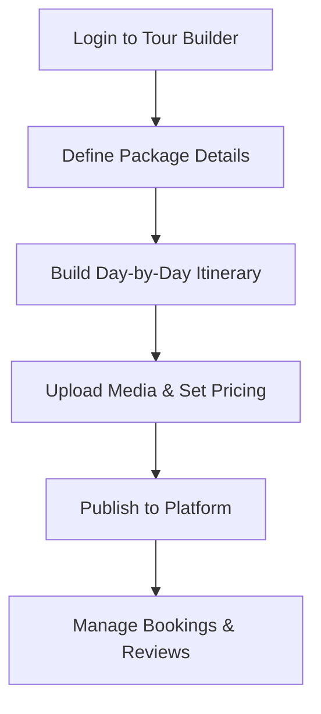
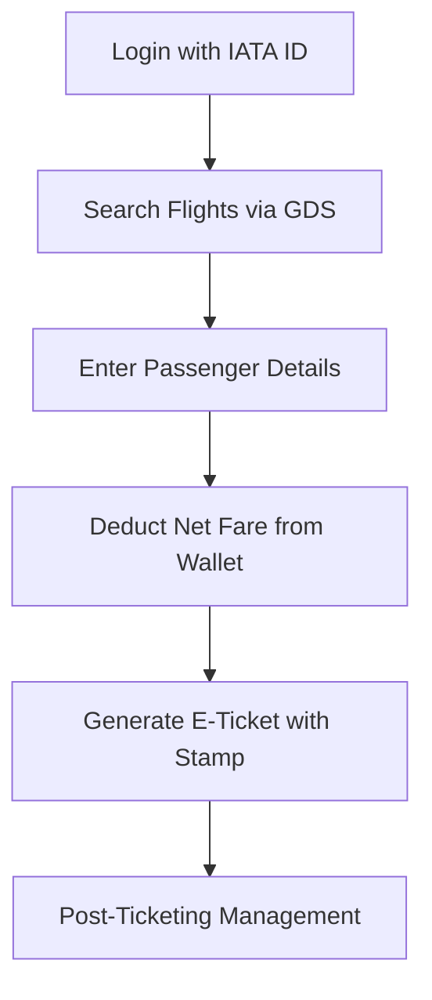
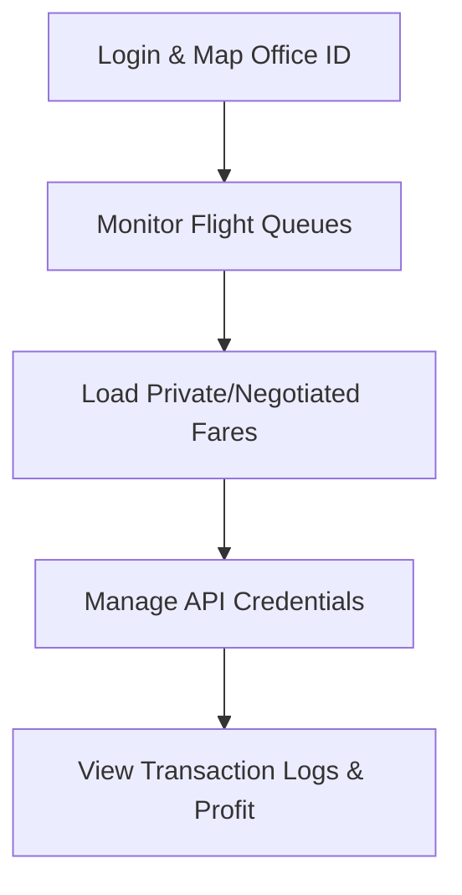
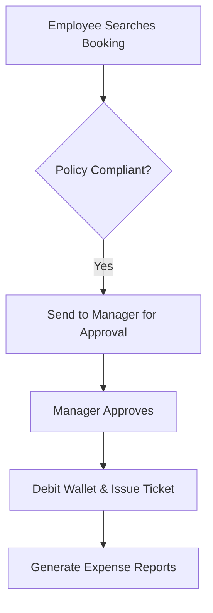
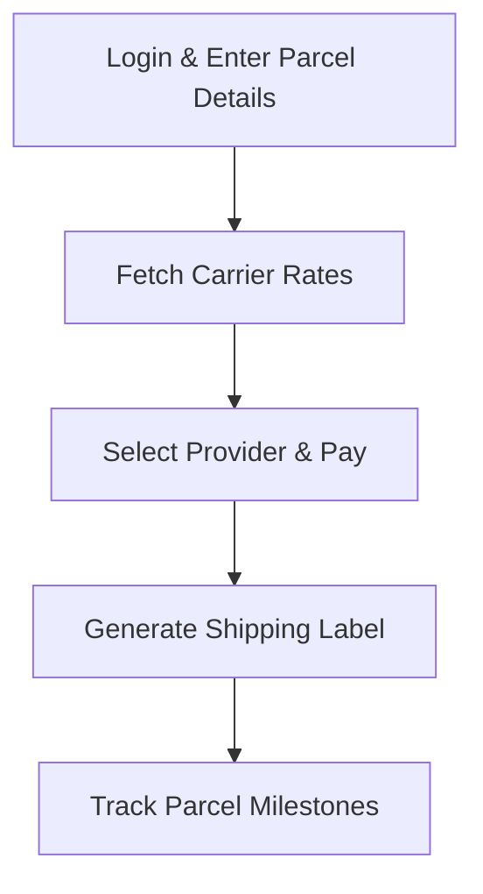
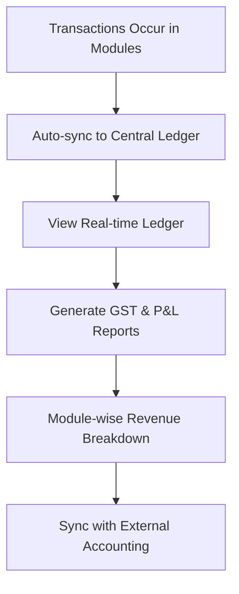

# Comprehensive System Panels Workflow

This document consolidates the detailed workflows, access credentials, and functionalities for all specialized panels within the platform, including affiliates and local service providers.

---

## 1. MASTER SUPER ADMIN PANEL
**URL:** `/admin/login` | **Dashboard:** `/admin-dashboard`
**Credentials:** `admin@tripzant.com` / `admin123`
**Description:** The global control center of the platform governing user roles, financials, API integrations, and CMS.

**Workflow:**
1. System Admin logs in to view global platform health (Total Sales, Active Agents).
2. Sets Global Markup percentages for Flights, Hotels, and Tours.
3. Reviews and Approves KYC documents for new IATA or B2B Agents.
4. Manages API Keys for vendors like Amadeus, Hotelbeds, and Carrier gateways.
5. Audits system logs to ensure security and transparency.
6. Manages the platform's visual content via the CMS modules.

---

## 2. TOUR B2B AGENT PANEL (Affiliate)
**URL:** `/agent/login` | **Dashboard:** `/agent-dashboard`
**Credentials:** `b2b@tripzant.com` / `b2b123`
**Description:** The B2B Agent Portal is a multi-service travel marketplace. It allows local travel agents (affiliates) to book Flights, Hotels, and customized Tour Packages for their walk-in customers while earning a commission set by the Master Admin.

**Workflow:**
1. Agent logs in and checks their Wallet Balance.
2. Selects a service (e.g., Hotel or Tour Package).
3. **For Hotels:** Search -> Select Room -> Instant Book or Request a Quote.
4. **For Flights:** Search -> Add Markup -> Share Quotation or Issue Ticket.
5. All bookings are tracked in the 'My Bookings' section.
6. Earnings and Profit Margins are visible in the Reports section.

---

## 3. HOTEL & TOUR SUPPLIER PANEL (Local Service Provider)
**URL:** `/supplier/login` | **Dashboard:** `/supplier/dashboard`
**Credentials:** `tour@tripzant.com` / `tour123`
**Description:** This panel is for Property Owners and Tour Operators (local providers) to list their inventory. It acts as a Channel Manager where suppliers can manage rates, availability, and respond to custom B2B negotiation requests.

**Workflow:**
1. Supplier logs in and updates their Inventory (Room/Package availability).
2. Sets 'Seasonal Rates' and 'Promotional Offers'.
3. Receives 'Quote Requests' from B2B agents for group bookings.
4. Enters a Negotiated Price and sends the quote back to the agent.
5. Once payment is confirmed, a Voucher is automatically issued to the customer.
6. Supplier views Earnings and Payout history in the Financials section.

---

## 4. TOUR BUILDER & PACKAGE DESIGNER
**URL:** `/supplier/login` | **Dashboard:** `/tourbuilder-dashboard`
**Credentials:** `tour@tripzant.com` / `tour123`
**Description:** The Tour Builder panel is a specialized environment for tour operators to design, price, and publish holiday packages. It allows for the creation of multi-day itineraries, including transport, accommodation, and activities.

**Workflow:**
1. Tour Operator logs in and goes to the 'Package Builder' section.
2. Defines the Package Name, Duration (e.g., 5 Days / 4 Nights), and Destination.
3. Steps through the ITINERARY builder (Day 1: Arrival, Day 2: City Tour, Day 3: Leisure).
4. Uploads high-quality photos and videos of the tour.
5. Sets 'Live Pricing' (Solo/Couple/Group rates) and Booking Policies.
6. Package is published to the B2B marketplace and B2C frontend.
7. Manages received bookings and views feedback/reviews.

---

## 5. IATA AGENT MODULE
**URL:** `/iata/login` | **Dashboard:** `/iata-dashboard`
**Credentials:** `iata@tripzant.com` / `agent123`
**Description:** Designed for professional travel agents who have direct ticketing authority. It provides a direct bridge to GDS (like Amadeus), allowing for real-time issuance of airline tickets without third-party markups.

**Workflow:**
1. Login with IATA credentials.
2. Search for flights using the direct GDS engine.
3. Select a flight and enter passenger details.
4. System deducts the Net Fare from the Agent's pre-paid Wallet.
5. Instant E-Ticket is generated with the IATA Stamp.
6. Manage post-ticketing services like Voiding, Re-issuance, or BSP Ledger tracking.

---

## 6. AMADEUS GDS PARTNER PANEL
**URL:** `/partner/login` | **Dashboard:** `/amadeus-dashboard`
**Credentials:** `amadeus@tripzant.com` / `partner123`
**Description:** Administrative portal for GDS Partners for the technical management of Amadeus Office IDs (PCCs), flight queues, and configuration of private/negotiated fares.

**Workflow:**
1. GDS Partner logs in and maps their specific Office ID (PCC).
2. Monitors 'Queue 1' for ticket changes or flight cancellations.
3. Loads 'Private Fares' for specific airline segments.
4. Manages API credentials and monitoring for the flight search engine.
5. Views detailed transaction logs and profit distribution between IATA and Sub-agents.

---

## 7. CORPORATE ENTERPRISE PANEL
**URL:** `/corporate/login` | **Dashboard:** `/corporate-dashboard`
**Credentials:** `corporate@tripzant.com` / `corp123`
**Description:** Facilitates business travel management. It allows large organizations to set travel policies, manage employee profiles, and centralize travel expenses for GST/tax compliance.

**Workflow:**
1. Employee searches for a flight/hotel for a business trip.
2. System checks if the selection complies with the 'Travel Policy'.
3. If compliant, the request is sent to the 'Reporting Manager' for approval.
4. Manager receives a notification and clicks 'Approve' on their dashboard.
5. The Corporate Wallet is debited, and the ticket is issued.
6. Admin generates monthly Expense Reports for accounting.

---

## 8. INTERNATIONAL CARGO PANEL
**URL:** `/cargo/login` | **Dashboard:** `/user-cargo`
**Credentials:** `cargo@gmail.com` / `cargo123`
**Description:** An end-to-end logistics platform connecting users with global carriers (DHL, FedEx). Provides tools for tracking, labeling, and B2B API integration.

**Workflow:**
1. User logs in to the Cargo Dashboard.
2. Clicks 'Book Shipment' and enters Parcel Dimensions, Weight, and Destination.
3. System fetches real-time rates from Integrated Carriers.
4. User selects a provider and pays via Wallet/Gateway.
5. System generates a Digital Shipping Label and Consignment Note.
6. Parcel status is tracked through milestones (Pickup -> Clearance -> Delivery).

---

## 9. AUTOMATED ACCOUNTING PANEL
**URL:** `/accounting/dashboard`
**Access:** Accessible via Super Admin Credentials
**Description:** Specialized module for financial tracking. Automates the generation of Invoices, GST reports, and Profit/Loss statements across all travel and cargo modules.

**Workflow:**
1. System automatically syncs every transaction (Booking/Refund) into the Central Ledger.
2. Accountant/Admin views the 'Real-time Ledger' to track cash flows.
3. Generates Monthly GST Reports compatible with tax filing systems.
4. Breaks down 'Commission Earned' vs 'Revenue' for specific modules.
5. Syncs data with external accounting platforms.

